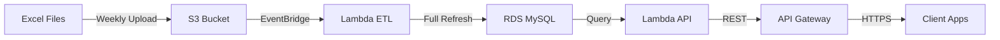

# E1 Certification - Data Catalog ETL Pipeline

A serverless ETL pipeline for synchronizing Collibra data catalog metadata to AWS RDS MySQL, with automated weekly refresh and REST API access.

## 🚀 Quick Start

```bash
# Clone and setup
git clone https://github.com/your-org/e1-certification.git
cd e1-certification
make install

# Configure environment
cp .env.example .env
# Edit .env with your settings

# Deploy to AWS
make deploy-dev

# Upload Excel files
make upload

# Test API
curl https://your-api-url/dev/health

# Access Swagger UI
open https://your-api-url/dev/docs
```

## 📋 Overview

This project automates the synchronization of data catalog metadata from Excel exports to a cloud database, providing:

- **Automated weekly ETL** processing via AWS Lambda
- **Full database refresh** strategy to ensure consistency
- **REST API** for querying the synchronized data
- **Serverless architecture** for cost efficiency

## 📚 Documentation

### Architecture & Workflows

- [ETL Workflow Architecture](docs/architecture/etl-workflow.md) - Detailed ETL process with diagrams
- [System Architecture](docs/architecture/overview.md) - Overall system design

### Operational Guides

- [Operations Guide](docs/guides/operations.md) - Day-to-day operations and monitoring
- [Setup Guide](docs/guides/setup.md) - Detailed installation instructions
- [Deployment Guide](docs/guides/deployment.md) - AWS deployment procedures

### API Documentation

- [API Endpoints](docs/api/endpoints.md) - REST API reference
- API Base URL: Provided after deployment
- Swagger UI: Available at `{API_URL}/docs`

### Support

- [Troubleshooting Guide](docs/troubleshooting.md) - Common issues and solutions

## 🏗️ Architecture



## 🛠️ Technology Stack

- **AWS Services**: Lambda, S3, RDS MySQL, EventBridge, API Gateway
- **Language**: Python 3.12
- **Framework**: AWS SAM (Serverless Application Model)
- **Libraries**: SQLAlchemy, Pandas, Pydantic
- **API Framework**: FastAPI with Mangum adapter
- **Authentication**: JWT tokens
- **API Documentation**: OpenAPI/Swagger UI

## 📁 Project Structure

```
e1-certification/
├── src/                    # Source code
│   ├── e1_certification/   # Main package
│   │   ├── api/           # API endpoints
│   │   ├── db/            # Database models
│   │   ├── etl/           # ETL processing
│   │   └── lambda_handlers/# Lambda functions
├── scripts/               # Utility scripts
├── tests/                 # Test suite
├── docs/                  # Documentation
├── template.yaml          # SAM template
└── Makefile              # Dev commands
```

## 🔧 Development

### Prerequisites

- Python 3.12+
- AWS CLI configured
- AWS SAM CLI
- Docker (for local testing)
- Make

### Local Development

```bash
# Install dependencies
make install

# Run tests
make test

# Run local ETL
make etl-local

# Start local API
make api-local

# Test local API
curl http://localhost:8000/health

# Access local Swagger UI
open http://localhost:8000/docs
```

### Environment Variables

Create a `.env` file from `.env.example`:

```bash
# AWS Configuration
AWS_PROFILE=your-profile
AWS_REGION=eu-west-3

# Database Configuration
DB_HOST=localhost
DB_PORT=3306
DB_NAME=e1_certification
DB_USER=root
DB_PASSWORD=your-password

# S3 Configuration
S3_BUCKET_NAME=e1-certification-excel-dev
```

## 📊 Data Model

The system manages four main entities:

- **Communities** (communautes) - Top-level organizational units
- **Domains** (domaines) - Business domains within communities
- **Tables** (data_tables) - Data tables within domains
- **Columns** (data_colonnes) - Column definitions for tables

## 🔌 API Access

The REST API provides programmatic access to the catalog data:

- **Swagger UI**: Available at `/docs` for interactive testing
- **Authentication**: JWT tokens with 30-minute expiration
- **Rate Limits**: AWS API Gateway defaults apply

See [API Documentation](docs/api/endpoints.md) for detailed endpoint reference.

## 🚢 Deployment

### Deploy to Development

```bash
make deploy-dev
```

After deployment, you'll get outputs including:

- **API URL**: `https://{api-id}.execute-api.eu-west-3.amazonaws.com/dev`
- **Swagger UI**: `https://{api-id}.execute-api.eu-west-3.amazonaws.com/dev/docs`

### Test Deployed API

```bash
# Get API URL from stack outputs
API_URL=$(sam list stack-outputs --stack-name e1-certification-dev --output json | jq -r '.[] | select(.OutputKey=="ApiUrl") | .OutputValue')

# Test health endpoint
curl $API_URL/health

# Access Swagger UI
echo "Swagger UI: $API_URL/docs"
```

### Deploy to Production

```bash
make deploy-prod
```

See [Deployment Guide](docs/guides/deployment.md) for detailed instructions.

## 📈 Monitoring

- **CloudWatch Logs**: Lambda execution logs
- **CloudWatch Metrics**: Performance metrics
- **S3 Buckets**: File processing status

See [Operations Guide](docs/guides/operations.md) for monitoring details.

## 🧪 Testing

```bash
# Unit tests
make test-unit

# Integration tests
make test-integration

# Full test suite
make test
```

## 🤝 Contributing

1. Create a feature branch
2. Make your changes
3. Add/update tests
4. Update documentation
5. Submit a pull request

## 📄 License

MIT License

## 👥 Team

- Grégory MARTIN - Data/AI Developer

---

For detailed information, explore the [documentation](docs/).
