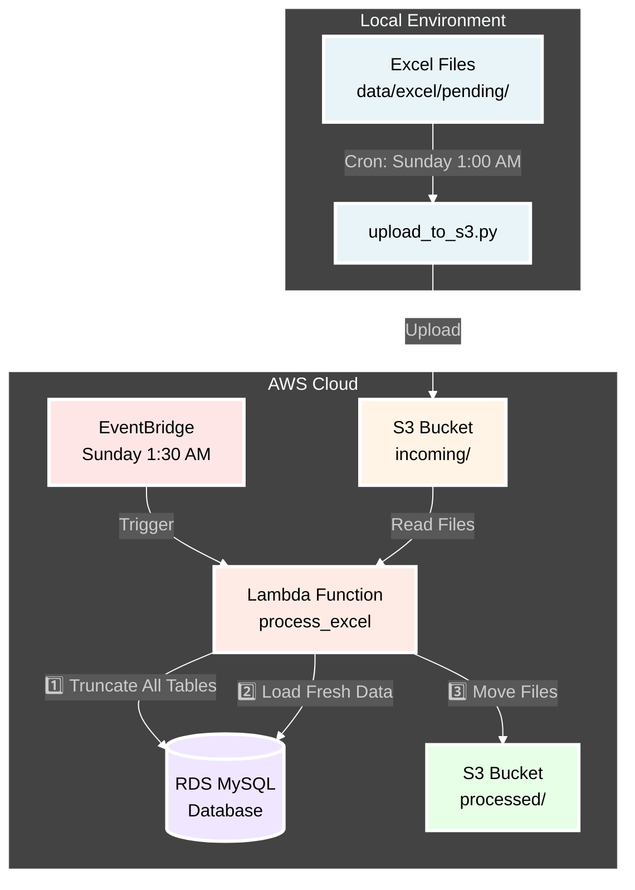
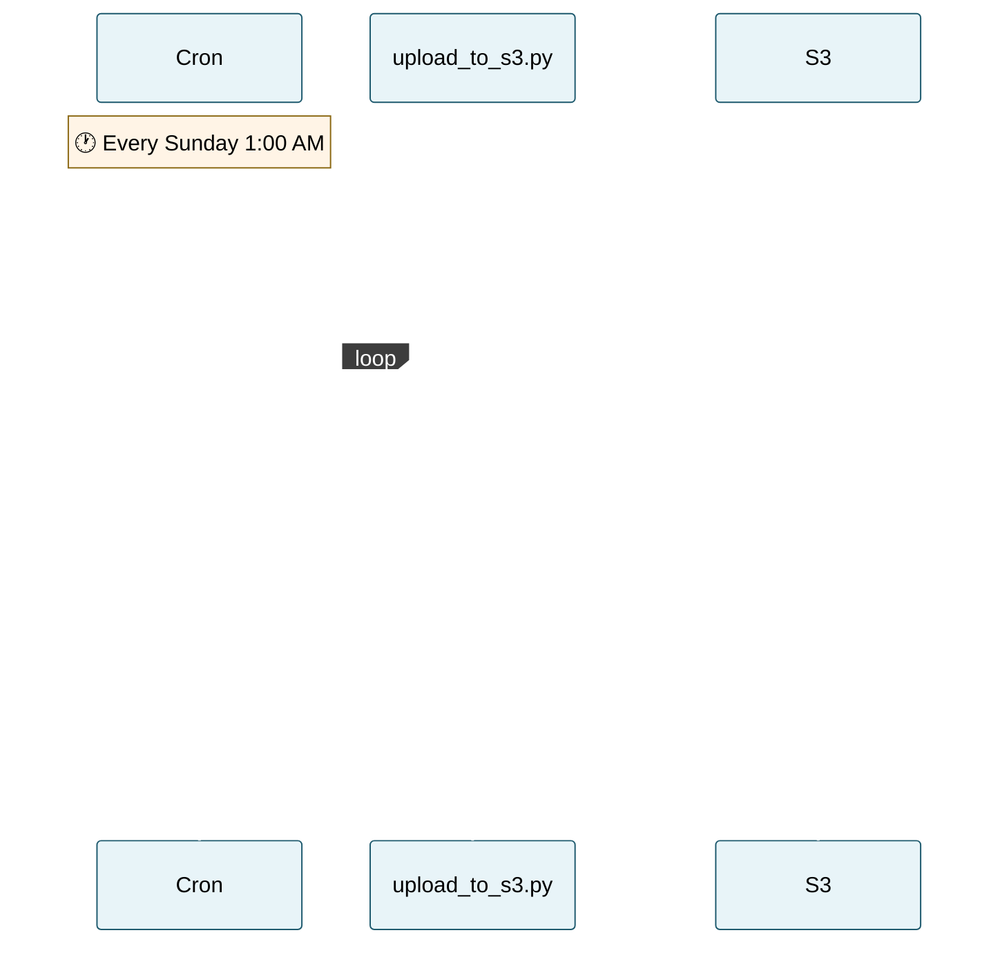
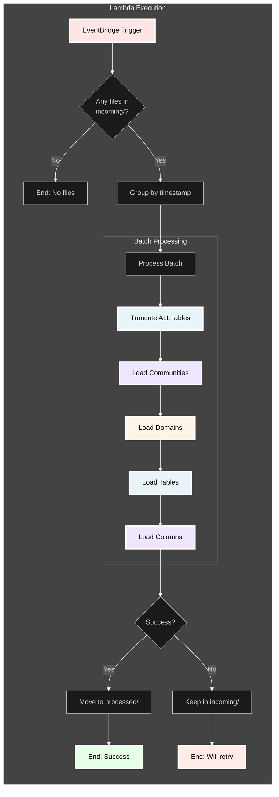
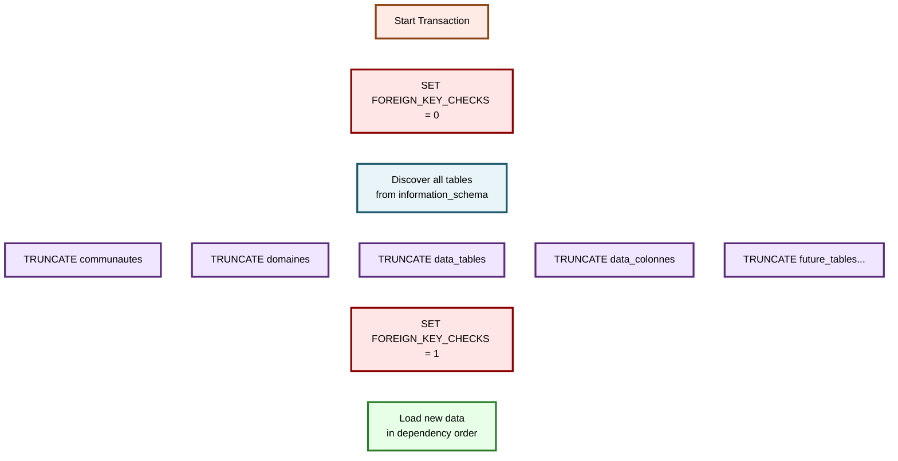
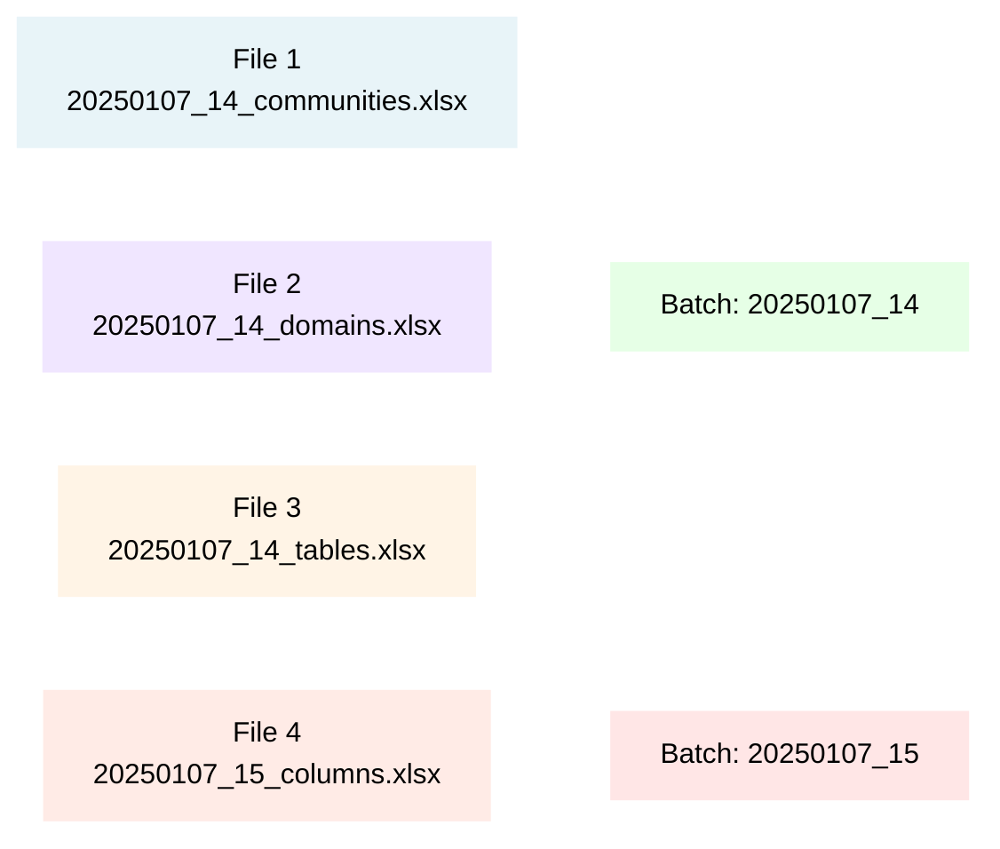
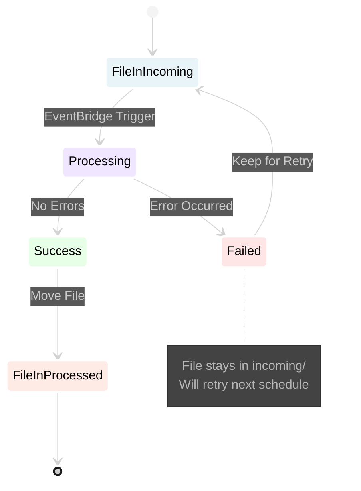
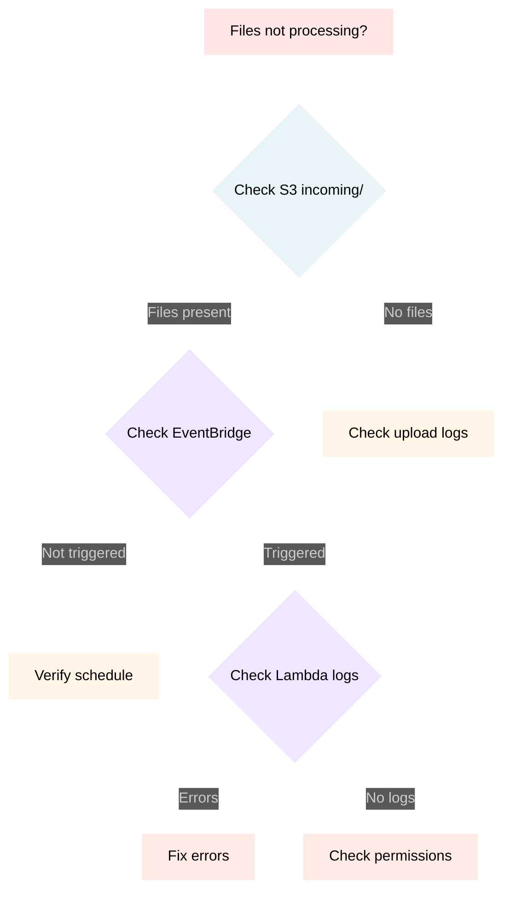

# ETL Workflow Architecture

## Overview

The E1 Certification ETL (Extract, Transform, Load) workflow is a serverless pipeline that automatically refreshes a MySQL database with data from Excel files. The system runs weekly and ensures data consistency through a complete refresh strategy.

## High-Level Architecture



## Detailed Workflow

### 1. File Upload Process



### 2. ETL Processing Flow



### 3. Database Refresh Strategy



## File Processing Details

### File Naming Convention

Files must follow this pattern for proper batch grouping:

```
{timestamp}_{description}.xlsx

Where:
- timestamp: YYYYMMDD_HH (year, month, day, hour)
- description: metadata_communities_v2, metadata_domaines_v2, etc.

Example: 20250107_14_metadata_communities_v2.xlsx
```

### Processing Order

Files are processed in a specific order to respect foreign key constraints:

1. **Communities** (communautes) - No dependencies
2. **Domains** (domaines) - Depends on communities
3. **Tables** (data_tables) - Depends on domains
4. **Columns** (data_colonnes) - Depends on tables

### Batch Grouping Logic



Files with the same timestamp prefix are processed together as one batch.

## Schedule Configuration

### Production Schedule

| Component   | Schedule     | Time (UTC) | Purpose                  |
| ----------- | ------------ | ---------- | ------------------------ |
| Local Cron  | Every Sunday | 1:00 AM    | Upload Excel files to S3 |
| EventBridge | Every Sunday | 1:30 AM    | Process uploaded files   |

### Manual Execution

For testing or on-demand processing:

```bash
# Upload files manually
python scripts/upload_to_s3.py

# Trigger Lambda manually
aws lambda invoke \
    --function-name e1-certification-dev-process-excel \
    --cli-binary-format raw-in-base64-out \
    --payload '{"source": "aws.events"}' \
    response.json
```

## Error Handling

### Retry Strategy



### Common Issues

1. **Foreign Key Errors**: Should not occur with full refresh strategy
2. **Timeout**: Lambda has 15-minute timeout for large datasets
3. **Permission Errors**: Lambda needs S3CrudPolicy for file operations

## Monitoring

### CloudWatch Logs

Monitor execution through CloudWatch:

```bash
# Tail Lambda logs
make logs

# Search for errors
aws logs filter-log-events \
    --log-group-name /aws/lambda/e1-certification-dev-process-excel \
    --filter-pattern "ERROR"
```

### Key Metrics to Monitor

- **Processing Time**: ~50-60 seconds for full dataset
- **Records Loaded**:
  - Communities: ~20
  - Domains: ~145
  - Tables: ~1,356
  - Columns: ~61,113
- **Files Processed**: 4 per batch

## Best Practices

1. **Always upload complete sets** - All 4 files should be uploaded together
2. **Use consistent timestamps** - Upload files within the same hour
3. **Monitor first run** - Check logs after schedule changes
4. **Keep processed files** - Archive in S3 for audit trail
5. **Test locally first** - Use `make etl-local` before uploading

## Troubleshooting

### Files Not Processing



### Database Not Updating

1. Check truncation succeeded in logs
2. Verify all 4 files were provided
3. Check for foreign key errors
4. Ensure correct file naming

### Performance Issues

- Increase Lambda memory if needed (current: 1024 MB)
- Check RDS instance performance
- Monitor network latency

## Future Possible Enhancements

- [ ] Add SNS notifications for failures
- [ ] Implement data validation before loading
- [ ] Add CloudWatch dashboards
- [ ] Support incremental updates
- [ ] Add data quality checks
