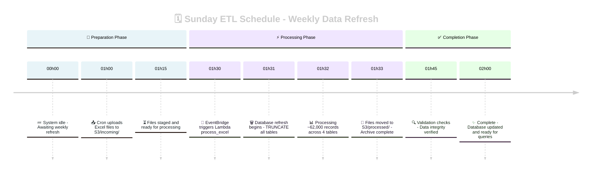

# Operations Guide

This guide covers day-to-day operations of the E1 Certification ETL system.

## Table of Contents

1. [Regular Operations](#regular-operations)
2. [Manual Operations](#manual-operations)
3. [Monitoring](#monitoring)
4. [Troubleshooting](#troubleshooting)
5. [Emergency Procedures](#emergency-procedures)

## Regular Operations

### Weekly Workflow

The system runs automatically every Sunday:



### Preparing Files for Upload

1. **Place files in pending directory**:

   ```bash
   cd ~/path/to/project
   ls data/excel/pending/
   ```

2. **Verify all 4 files are present**:

   - `metadata_communities_v2.xlsx`
   - `metadata_domaines_v2.xlsx`
   - `metadata_tables_v2.xlsx`
   - `metadata_columns_v2.xlsx`

3. **Files will be automatically uploaded** Sunday at 1:00 AM

## Manual Operations

### Manual File Upload

When you need to update the database immediately:

```bash
# Navigate to project root
cd ~/path/to/project

# Activate virtual environment
source .venv/bin/activate

# Upload files
python scripts/upload_to_s3.py
```

Expected output:

```
🚀 Starting Excel file upload...
📋 Found 4 files to process
✅ Validated metadata_communities_v2.xlsx (0.1MB)
📤 Uploading to s3://e1-certification-excel-dev-XXX/incoming/20250107_14_metadata_communities_v2.xlsx
✅ Successfully uploaded
...
📊 Upload Summary:
   Total files: 4
   ✅ Uploaded: 4
   ❌ Failed: 0
```

### Manual ETL Trigger

After uploading files, trigger processing:

```bash
aws lambda invoke \
    --function-name e1-certification-dev-process-excel \
    --cli-binary-format raw-in-base64-out \
    --payload '{"source": "aws.events"}' \
    response.json

# Check results
cat response.json | jq .
```

### Checking S3 Buckets

```bash
# List files in incoming (pending processing)
aws s3 ls s3://e1-certification-excel-dev-$(aws sts get-caller-identity --query Account --output text)/incoming/

# List files in processed (completed)
aws s3 ls s3://e1-certification-excel-dev-$(aws sts get-caller-identity --query Account --output text)/processed/
```

## Monitoring

### Real-time Log Monitoring

```bash
# Start tailing logs
make logs

# Or save to file
make logs | tee etl_run_$(date +%Y%m%d_%H%M%S).log
```

### What to Look For

#### Successful Run Pattern:

```
🚀 Lambda handler started: EventBridge trigger
📋 Found 4 tables to truncate: communautes, data_colonnes, data_tables, domaines
✂️ Truncated table: communautes
🏛️ Processing communities...
✅ Loaded 20 communautes records
...
✅ Batch processing complete
✅ Moved incoming/20250107_14_metadata_columns_v2.xlsx to processed/
```

#### Warning Signs:

- ❌ Failed to move files
- ERROR messages
- Timeout after 300+ seconds
- Foreign key constraint errors

### Database Verification

```bash
# Connect to RDS
mysql -h e1-certification-dev-mysql.XXX.rds.amazonaws.com -u admin -p e1_certification

# Check record counts
SELECT 'communautes' as table_name, COUNT(*) as count FROM communautes
UNION ALL SELECT 'domaines', COUNT(*) FROM domaines
UNION ALL SELECT 'data_tables', COUNT(*) FROM data_tables
UNION ALL SELECT 'data_colonnes', COUNT(*) FROM data_colonnes;
```

Expected counts:
| Table | Expected Count |
|-------|----------------|
| communautes | 20 |
| domaines | 145 |
| data_tables | 1,356 |
| data_colonnes | 61,113 |

### CloudWatch Metrics

Check Lambda metrics:

```bash
# Get recent invocations
aws cloudwatch get-metric-statistics \
    --namespace AWS/Lambda \
    --metric-name Invocations \
    --dimensions Name=FunctionName,Value=e1-certification-dev-process-excel \
    --start-time $(date -u -d '1 day ago' +%Y-%m-%dT%H:%M:%S) \
    --end-time $(date -u +%Y-%m-%dT%H:%M:%S) \
    --period 3600 \
    --statistics Sum
```

## Troubleshooting

### Common Issues and Solutions

#### 1. Files Not Being Processed

**Symptom**: Files remain in `incoming/` after schedule

```bash
# Check if files exist
aws s3 ls s3://BUCKET/incoming/
```

**Solutions**:

- Verify EventBridge rule is enabled
- Check Lambda function permissions
- Manual trigger to test

#### 2. Database Not Updated

**Symptom**: Old data still present after ETL run

**Check truncation in logs**:

```bash
grep "Truncated table" your_log_file.log
```

**Solutions**:

- Verify database connectivity
- Check foreign key constraints
- Ensure all 4 files were processed

#### 3. Partial Processing

**Symptom**: Some tables updated, others not

**Identify which files failed**:

```bash
grep "Failed\|ERROR" your_log_file.log
```

**Solutions**:

- Check file naming matches expected pattern
- Verify Excel file format/structure
- Look for data quality issues

#### 4. Performance Issues

**Symptom**: Processing takes >5 minutes

**Monitor execution time**:

```bash
grep "Duration:" your_log_file.log
```

**Solutions**:

- Increase Lambda memory allocation
- Check RDS instance performance
- Verify network connectivity

### Debug Commands

```bash
# Check EventBridge rule status
aws events describe-rule \
    --name $(aws events list-rules | jq -r '.Rules[] | select(.Name | contains("e1-certification")) | .Name')

# Test database connection
mysql -h YOUR_RDS_ENDPOINT -u admin -p -e "SELECT 1"

# Verify Lambda environment variables
aws lambda get-function-configuration \
    --function-name e1-certification-dev-process-excel \
    --query 'Environment.Variables'
```

## Emergency Procedures

### Emergency Database Restore

If data is corrupted:

1. **Stop scheduled processing**:

   ```bash
   aws events disable-rule --name YOUR_EVENTBRIDGE_RULE_NAME
   ```

2. **Clear incoming files**:

   ```bash
   aws s3 rm s3://BUCKET/incoming/ --recursive
   ```

3. **Upload known good files** and process manually

4. **Re-enable schedule** after verification:
   ```bash
   aws events enable-rule --name YOUR_EVENTBRIDGE_RULE_NAME
   ```

### Lambda Function Rollback

If new deployment causes issues:

```bash
# List function versions
aws lambda list-versions-by-function \
    --function-name e1-certification-dev-process-excel

# Update alias to previous version
aws lambda update-alias \
    --function-name e1-certification-dev-process-excel \
    --name prod \
    --function-version PREVIOUS_VERSION_NUMBER
```

### Direct Database Intervention

As last resort, manually truncate tables:

```sql
-- Connect to database
mysql -h RDS_ENDPOINT -u admin -p e1_certification

-- Disable FK checks
SET FOREIGN_KEY_CHECKS = 0;

-- Truncate in reverse dependency order
TRUNCATE TABLE data_colonnes;
TRUNCATE TABLE data_tables;
TRUNCATE TABLE domaines;
TRUNCATE TABLE communautes;

-- Re-enable FK checks
SET FOREIGN_KEY_CHECKS = 1;
```

## Best Practices

1. **Always verify file counts** before manual uploads
2. **Monitor first run** after any configuration changes
3. **Keep processed files** for at least 30 days
4. **Document any manual interventions** in team wiki
5. **Test in dev** before promoting to production

## Support Contacts

- **AWS Support**: [Support Case Link]
- **Database Admin**: [Contact Info]
- **DevOps Team**: [Slack Channel]
- **On-call Engineer**: [PagerDuty]
